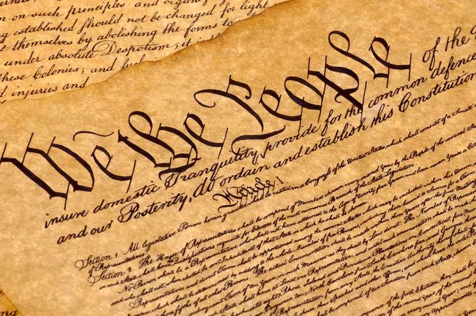

# Constitutional Convention
 

     Ashley Hernandez Civics P.1
[Website](https://chsserver01.org/2023/ahernandez062023/ "Go to Website")
 

 

---

  * 1787 - Const conv in philadelphia
  * 55 Delegates - Create new gov
  * James Madison - Author of new gov plan
  * States would each have 1 vote
  * Agreed on having 3 branches of gov, limited gov, and protect citizen's rights.
  
   ---

  ### The Virginia Plan
  * Virginia delegation proposed new plan
  * Gov legislature (2 Chambers) - lower chamber chosen by people. Upper, chosen by the lower
  * Number of ppl living in state has power to ban state laws
  * Executive branch - chosen by the legis
  * Judiciary (appointed by legis)
  ### The New Jersey Plan

   ---
  * Delegates of small states = counterproposal
  * gov legis with 1 vote each state
  * Congress = strong (gets taxes/trade)

   ---

  ### The Conneticut Compromise
  * Legislative branch (2 houses)
  * House of representatives (based on population)
  * A Senate (2 members from state)
 * Larger states = more power

  ---

 ### Compromises About The Presidency
 * Electoral college system
 * vote from state electors
 * president 4 - year compromise

  ---

 # Disputes Over SLavery
 * Debate on slavery abolishment
 * Did not mention/solve slavery bc of the south

  ---

 ### The Three Fifths Compromise
 * 3/5 People counted for taxes and representations
 * counted until 1868

  ---

 ### Commerce And The Slave Trade
 * Deals with slave trade
 * COngress has power to regulate trade between states 
 * Congress can not export taxes

  ---

 # Ratifying The Constitution
 * Constitution complete Sep 17, 1787
 * Signed by 39 Delegates
 * Has to be ratified by 9 of 13 Sates
 * Effective on 1788

  ---

 ### The Federalists And Anti - Federlists 
 * Federalists - supported
 * Anti - Federalists - opposed
 * Critized const, scared
 * George Mason - Against const/slave abolishment 
 * Anti (delcared lack BOR)
 * Patrick Henry(anti)

 ---
 ### Progress Towards Ratification
 * fed - won vote June 25, 1788
 * Alexander Hamilton/James Madison wrote essays 'Publius' defending const

 ---
 ### New Gov Begins Work
 * Geroge Washington Elected
 * John Addams - VP
 * James Madison Introduced BOR
 * Ratified in 1789
