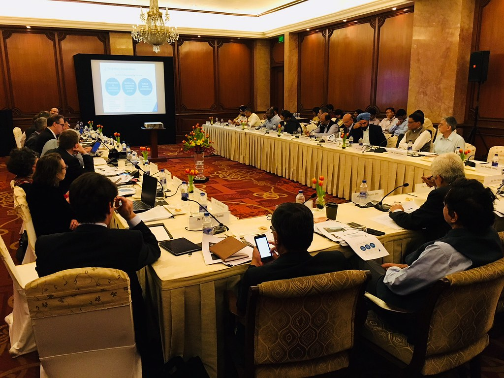

# Fiscal Federalism 
---
[Website](https://chsserver01.org/2023/ahernandez062023/)

#### Contegorical Grant - Funding only that comply with certain starndards 
* Head Start Programs 
* Magnet School Programs

#### Block Grant - A move that retuns power to states 
* Mental Health Programs
* Social Services 

#### Funded Mandates - Money given to states to carry out mandates by federal government 
* National Drinking Age Act
* Education Programs
#### Unfunded Mandates - Mandates that are not funded.
* Requirment on public safety/training
* Administration for Child Support

---
### Additional Vocabulary

#### Federalism - The share of power between states and national government

#### Reserved Powers - Powers delegated by constitution to federal goverment

